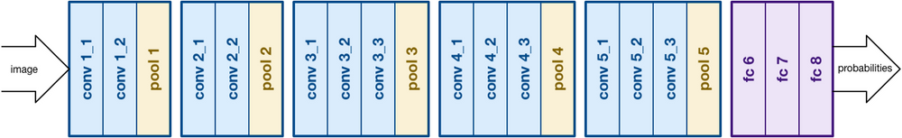

# Image Classification model VGG16 from scratch | Computer Vision with Pytorch

Neste repositório você encontrará tutoriais e projetos relacionados ao Deep learning. Eu tento deixar o código o mais claro possível, e o objetivo é ser usado como um recurso de aprendizado e uma forma de pesquisar problemas para resolver problemas específicos.

# VGG

Com base no trabalho do AlexNet, o VGG se concentra em outro aspecto crucial das Redes Neurais Convolucionais (CNNs), a profundidade. Foi desenvolvido por Simonyan e Zisserman. Normalmente consiste em 16 camadas convolucionais, mas também pode ser estendida para 19 camadas (daí as duas versões, VGG-16 e VGG-19). Todas as camadas convolucionais consistem em filtros 3x3. Você pode ler mais sobre a rede no artigo oficial https://arxiv.org/pdf/1409.1556.pdf

<p align="center">
</img>
</p>


<p align="center">
</img>
</p>


```python

print('==> Building model..')
device = 'cuda' if torch.cuda.is_available() else 'cpu'

net = vgg16scratch(n_classe).to(device)

print(net)

net = net.to(device)

print(device)

```
